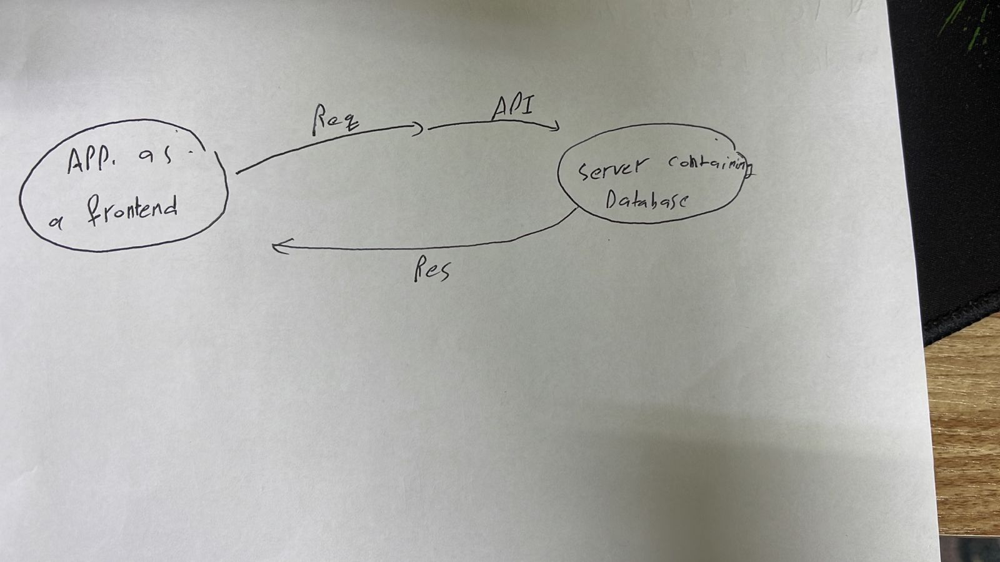

# i do a resubmit just to make sure the server is work

# Project Name - Project Version

**Author Name**: saif alkurdi

## WRRC

## Overview
creating database also sql .
## Getting Started
do npm start

## Project Features
provides add maove and get movie .

### the first question : 
i learned how to create a Rout using app.get also i learned how to add error funcyion.

### the second question :
it takes about 2 hour and the expicting time is 3 hours.
